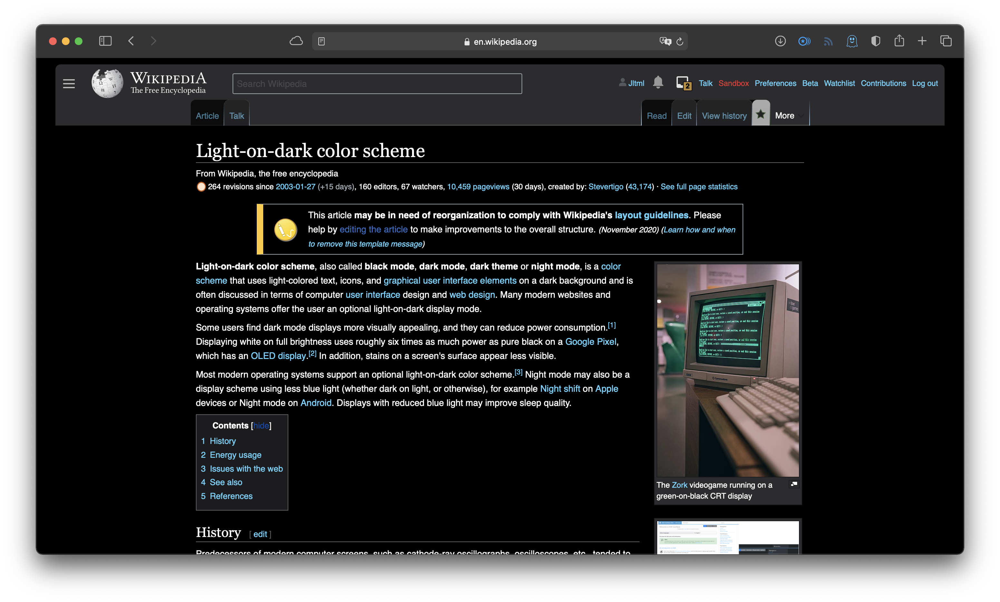

# wikipedia-darkmode



**Custom CSS for Wikipedia that enables a dark color scheme when system/browser dark mode is on.** Pretty rough around the edges at the moment, but it's much better than being blinded at midnight :)
## Setup
Log into Wikipedia and then head to [Preferences (top right) > Appearance](https://en.wikipedia.org/wiki/Special:Preferences#mw-prefsection-rendering). Copy the following line…
```css
@import url("https://jltml.me/wikipedia-darkmode/darkmode.css");
```
…and then paste it into one of the "custom css" pages (you can set it up for either all themes (globally) or just one theme, though I've only used and tested it with the default Vector theme). Once saved, it should Just Work every time you're logged in and your browser/system is set to dark mode.

*Note(s): it's controlled by the `@media color-scheme` tag, so it'll automatically switch between standard light and custom dark based on your browser/system's appearance.*
*Also, because I'm now using the `@import` CSS rule, it'll automatically update as I edit and improve the file.*
***If anyone ends up using this, pull requests are absolutely welcome!***

Enjoy!

~Jack
